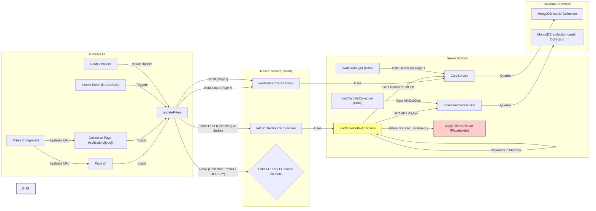

Okay, let's break down the current setup for loading and filtering cards, focusing on the distinction between the general card view and the collection view. This should help visualize the flow and pinpoint areas for refactoring.

**Explanation:**

1.  **UI Interaction:**
    *   Loading the main page (`/`) or the collection page (`/collection/[type]`) initializes the `CardsContext`.
    *   The `Filters` component updates the URL search parameters. This causes the page to receive new props, triggering `CardContainer` to call `updateFilters` in the context.
    *   Scrolling down in the `CardGrid` triggers `loadNextPage` in the context.

2.  **CardsContext Logic:**
    *   **Initialization:** Based on whether `initialCollectionType` is provided, it *should* know if it's on a collection page.
    *   **`updateFilters`:** Updates context state (`filters`, `collectionType`) and calls `loadCards` for page 1.
    *   **`loadCards` (Internal):** This function decides which Server Action to call based on `collectionType`.
        *   If `collectionType` is set: Calls `fetchCollectionCards`.
        *   If `collectionType` is NOT set: Calls `loadFilteredCards`.
    *   **`loadNextPage`:** Increments the page number and calls `loadCards`. **The suspected bug** is that when `loadNextPage` calls `loadCards`, the check for `collectionType` fails, causing it to call `loadFilteredCards` instead of `fetchCollectionCards`.

3.  **Server Actions (Data Fetching):**
    *   `loadFilteredCards`: Used for the main page. Leverages `CardService` to perform efficient filtering, sorting, and pagination directly in the database query.
    *   `loadMoreCollectionCards` (and `fetchCollectionCards` which wraps it): Used for the collection page.
        *   **Inefficiency:** It fetches *all* card IDs from your collection (`CollectionCardService`), then fetches details for *all* those cards (`CardService`).
        *   **In-Memory Filtering:** It then applies sorting and filtering logic **in memory** using the `applyFiltersAndSort` helper (which is currently just a placeholder returning all cards).
        *   **In-Memory Pagination:** Finally, it slices the already filtered (or not, due to placeholder) array to get the requested page. This is very inefficient for large collections.
    *   `loadCardsInCollection` / `loadCardsById`: Used only for the *initial* server-side render of the collection page to get the very first page of cards efficiently.

**Key Problems Identified:**

1.  **Context Bug:** The `loadNextPage` function likely fails to correctly identify that it's on a collection page, causing it to call the wrong data fetching action (`loadFilteredCards`).
2.  **Collection Filtering Inefficiency:** `loadMoreCollectionCards` loads all collection cards into memory before filtering and paginating, which won't scale well. The filtering logic (`applyFiltersAndSort`) isn't even implemented yet.

**Refactoring Suggestions:**

1.  **Fix Context Bug:** Debug `loadNextPage` and `loadCards` to ensure `collectionType` state is reliably used to call `fetchCollectionCards`.
2.  **Improve Collection Filtering:** Refactor `loadMoreCollectionCards` (or create a new action/service method) to perform filtering and pagination *at the database level* if possible. This might involve:
    *   Getting filtered card IDs from `CardService` first.
    *   Then, getting collection quantities *only* for those filtered IDs using `CollectionCardService`.
    *   Combining the data.
    *   This requires careful query construction.
3.  **Simplify Context:** Consider having separate contexts or at least more distinct state management for the general view vs. the collection view to reduce the complexity of the conditional logic in `loadCards`.

This breakdown should give you a clearer picture of the moving parts and where the issues likely lie. Good luck with the refactoring!
